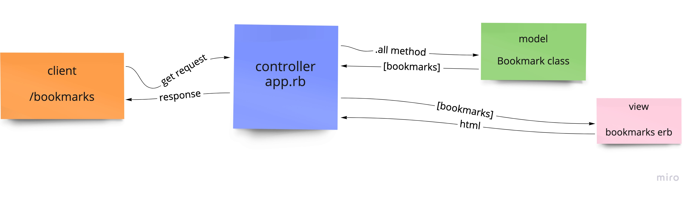

## User stories:
```
As a user
So that I can go to web sites I saved
I would like to see a list of bookmarks
```
As a user
So I can store bookmark data for later retrieval
I want to add a bookmark to Bookmark Manager
```
## Domain Model



## How to use
### To set up the project

Clone this repository and then run:

```
bundle
```
### To setup the database:
```
1) Connect to psql
2) Create the databases using the psql command CREATE DATABASE bookmark_manager; and CREATE DATABASE bookmark_manager_test;
3) Connect to the databases using the pqsl command \c bookmark_manager; and \c bookmark_manager_test;
4) Run the query we have saved in the file 01_create_bookmarks_table.sql for both databases
```
### To run the Bookmark Manager app:

```
rackup -p 3000
```

To view bookmarks, navigate to `localhost:3000/bookmarks`.

### To run tests:

```
rspec
```
